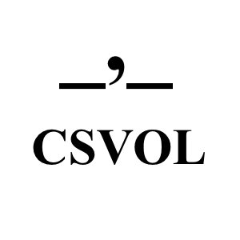

# CSVOL
Character Separated Value Organizer Language, or CSVOL (\kasväl\\), is an interpreted language that specializes in reporting and manipulating delimited files.

If you want to start a new CSVOL project, please clear all contents of the main.csvol file. The main.csvol file is where you can write CSVOL driver code for all additional modules. Alternatively, you may invoke CSVOL's REPL environment by writing PULL REPL to a blank main.csvol file. Please note that the REPL environment is still experimental, so some are temporarily disabled.



#### Why CSVOL?

The following is purely the opinion of Abir Haque, the author of CSVOL. Please feel free to share your opinions to the author's email, present in the Contact section of this file, after trying out the language. 

The intended application of CSVOL is very similar to those of Unix utilities, such as AWK, SED, and GREP [(1)](https://davidlyness.com/the-functional-and-performance-differences-of-sed-awk-and-other-unix-parsing-utilities). AWK, SED, and GREP are great utilities for parsing data to files, at least when used in combination with each other. However, each utility presents their own issues.

AWK does not support modularization [(2)](https://www.cs.rit.edu/~afb/20013/plc/slides/perlintro-03.html). In addition, math operations are difficult to express in SED [(3)](http://sed.sourceforge.net/sedfaq6.html)[(4)](https://unix.stackexchange.com/questions/36949/addition-with-sed). Finally, GREP lacks value replacing capabilities [(1)](https://davidlyness.com/the-functional-and-performance-differences-of-sed-awk-and-other-unix-parsing-utilities). CSVOL solves these limitations. CSVOL also attempts to place the positive aspects of said Unix utilities under one umbrella language.

While Perl, Python, Java, and other modern languages provide CSV file parsing capabilities, they too come with their own setbacks for developers. Perl does not offer an interactive shell [(5)](http://web.eecs.utk.edu/~bvanderz/cs460/notes/perl/perl1.html#title3). In addition, Perl does not provide strong portability [(5)](http://web.eecs.utk.edu/~bvanderz/cs460/notes/perl/perl1.html#title3). A minor setback seen in Python, Java, and other languages is that indentation and braces are mandatory to define blocks of code [(6)](https://data-flair.training/blogs/advantages-and-disadvantages-of-python/). CSVOL addresses these setbacks. CSVOL also attempts to gather the advantages seen in modern languages alongside the Unix utilities umbrella.

Of course, the CSVOL interpreter prototype comes with its own setbacks. Here are a few issues to name:
- Unfamiliar syntax and structure when compared to languages within the C family.
- Each line may have only one instruction or comment.
- Extremely limited amount of features.
- Buggy looping when commanded through the terminal.
- Buggy error-line number reporting.

#### Built with
The interpreter is written in entirely Java. All development occurred on Repl.it.

#### Roadmap
We plan on moving meeting notes to a group website in the future. General meeting notes for all of Wichita CPU's operations can be found on [our group's public Google Doc](https://docs.google.com/document/d/1penokzeQKJ7PXM5JvUvn8pT_uso4QuSFwjQhdeqkrpU/edit).

Will implement the following features:
- Print individual rows, columns, and cells

Current features:
- Invocable REPL environment
- Create, add, edit, delete, and print file contents
- Modularization
- For loops
- Conditional statements
- Math operators

More additions will be decided upon and listed during general meetings.

#### Developers
The current members of the [Wichita Computer Programmers' Union](https://repl.it/@wichitacpu) are all students of [Wichita High School East](https://www.usd259.org/east), and CSVOL is the group's first project. Members that actively worked on CSVOL's development were:
- [Abir Haque](https://abirhaque.github.io/)
- William Kieu

#### Contact
Feel free to get in touch by sending an email to abir.haque.usa@gmail.com.

#### Project Links
- Main - https://repl.it/@wichitacpu/CSVOL
- Backup - https://github.com/AbirHaque/CSVOL

#### License
CSVOL is protected under the GNU General Public License v3.0. Please see the LICENSE file to view the license.

#### Sources
- (1) - https://davidlyness.com/the-functional-and-performance-differences-of-sed-awk-and-other-unix-parsing-utilities
- (2) - https://www.cs.rit.edu/~afb/20013/plc/slides/perlintro-03.html
- (3) - http://sed.sourceforge.net/sedfaq6.html
- (4) - https://unix.stackexchange.com/questions/36949/addition-with-sed
- (5) - http://web.eecs.utk.edu/~bvanderz/cs460/notes/perl/perl1.html#title3
- (6) - https://data-flair.training/blogs/advantages-and-disadvantages-of-python/
